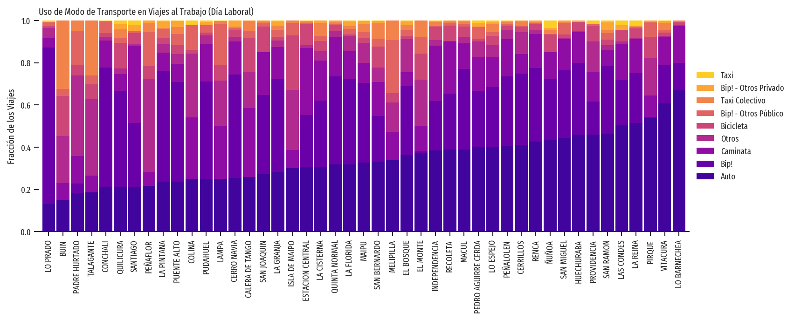
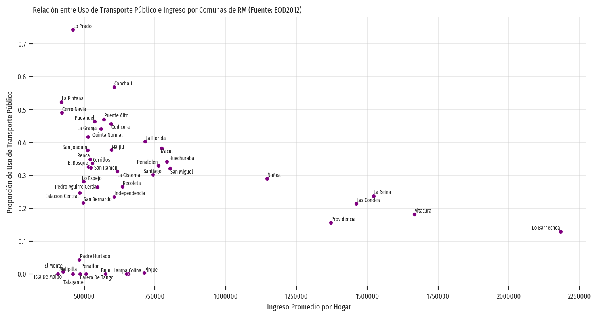
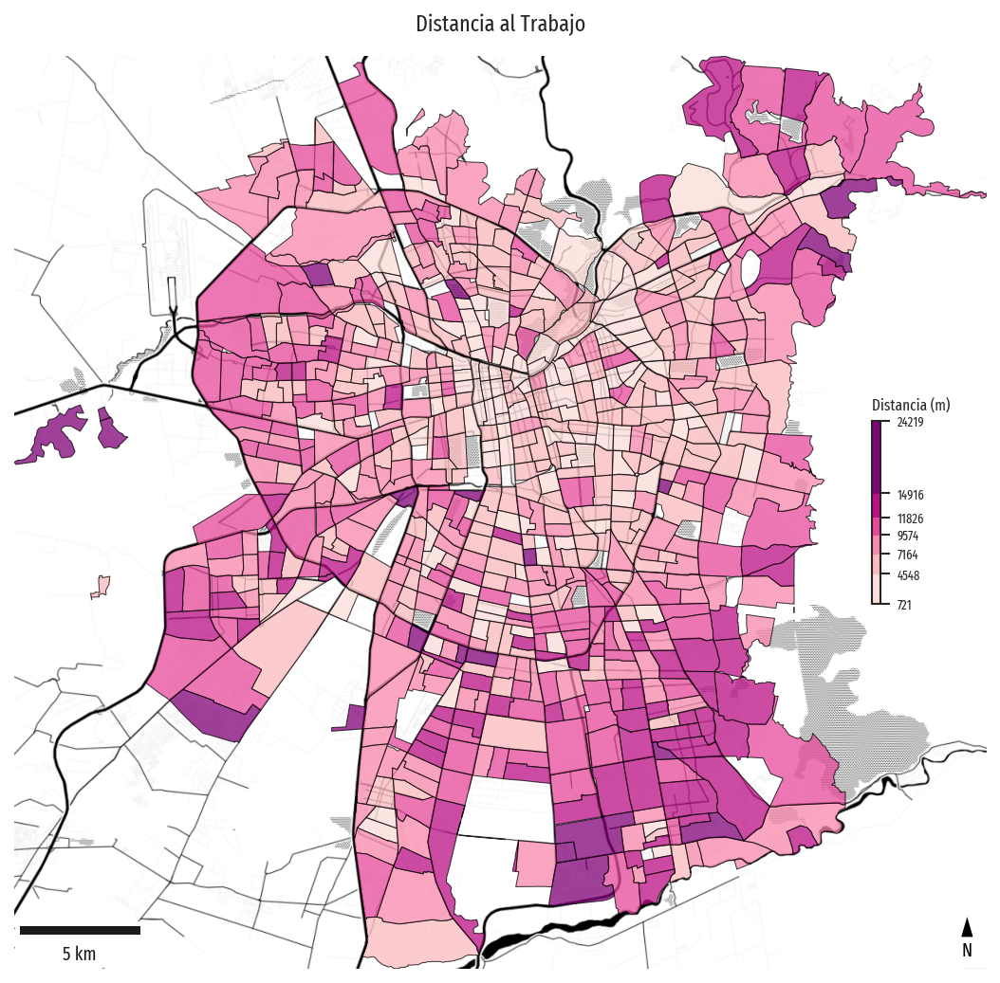
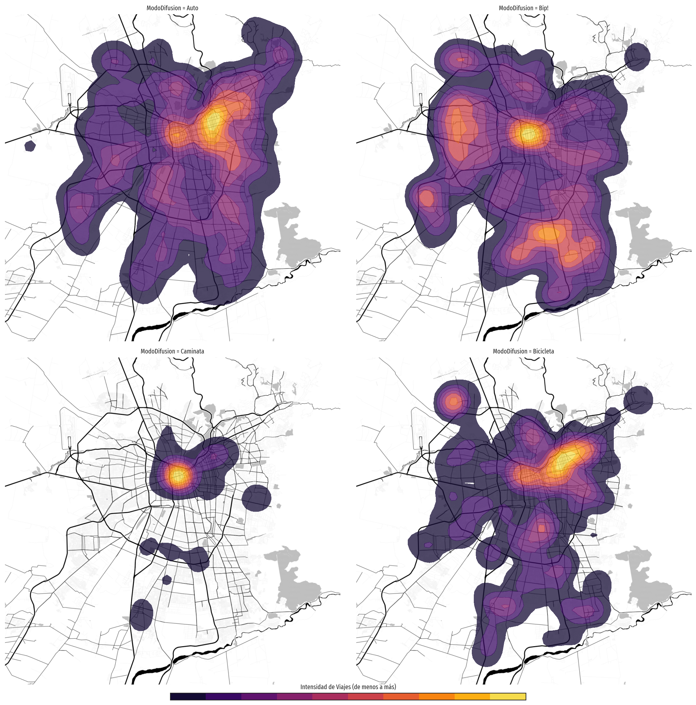
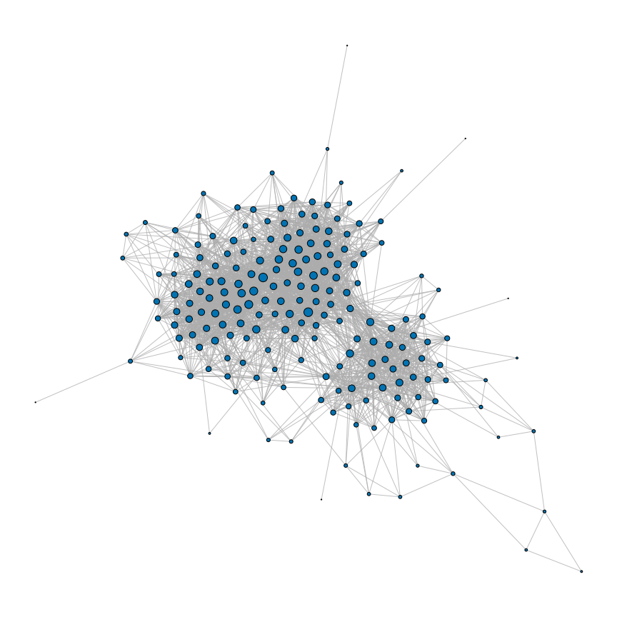
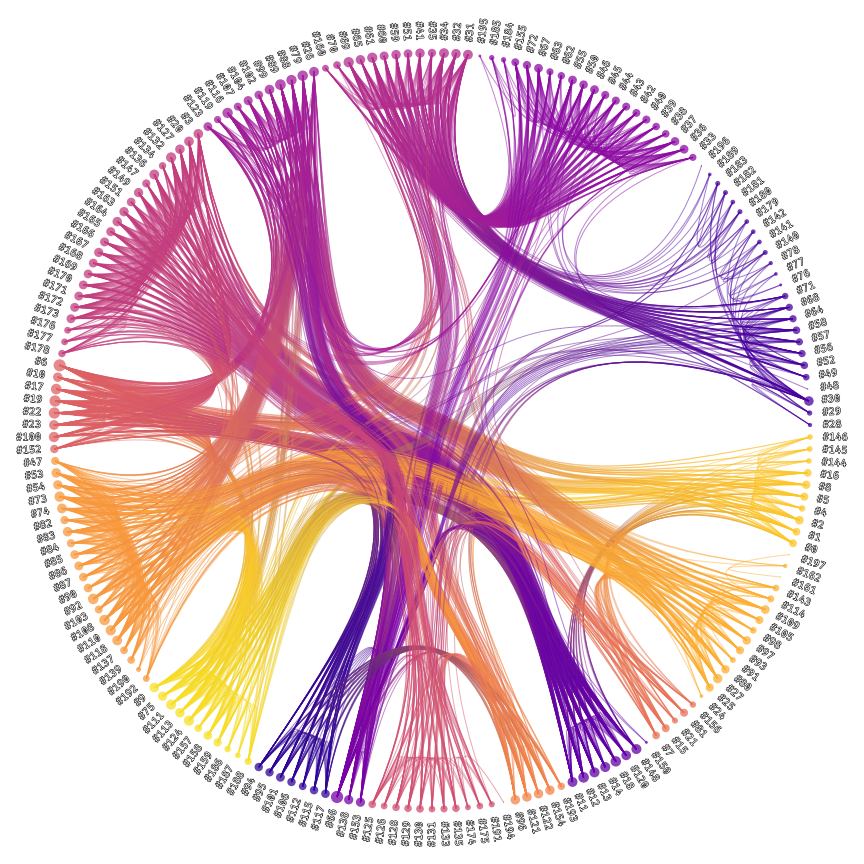
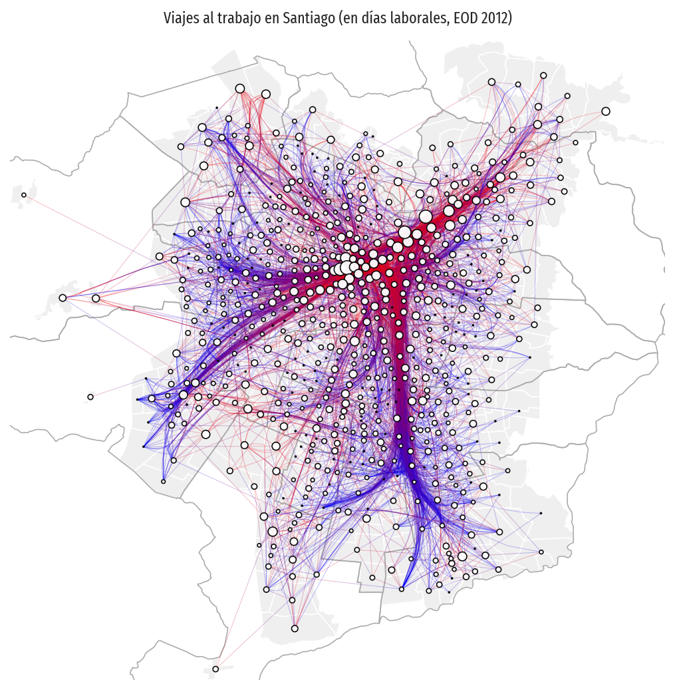
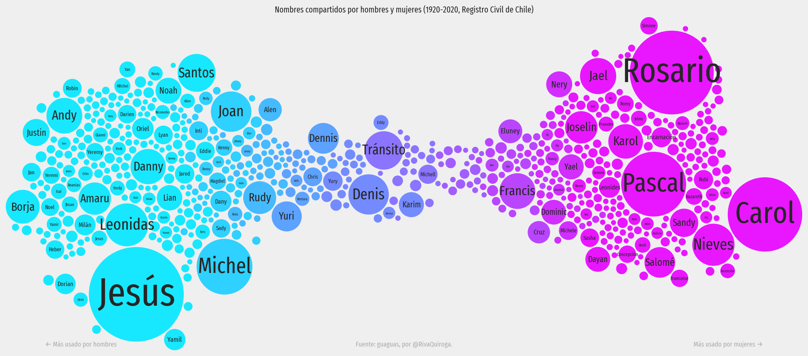

# 🐦 `aves`: Análisis y Visualización, Educación y Soporte

Por [Eduardo Graells-Garrido](http://datagramas.cl).

Este repositorio contiene datos, código y notebooks relacionados con mi [curso de Visualización de Información](http://datagramas.cl/courses/infovis) y mi trabajo diario. Lo he estructurado en un paquete llamado `aves`, sigla descrita en el título de este documento. 

El código fuente (carpeta `src/aves`) tiene la siguiente estructua:

```
aves 1.1.1
├── data
│   ├── census.py   : carga del Censo 2017 de Chile
│   └── eod.py      : carga de la Encuesta Origen-Destino 2012 de Santiago
├── features
│   ├── geo.py      : utilidades geográficas (para mapas)
│   ├── geometry.py : utilidades geométricas
│   ├── twokenize   : procesamiento de texto con ark-twokenize (ver créditos)
│   └── utils.py    : funciones utilitarias para DataFrames
├── models
│   ├── datafusion  : envoltura para scikit-fusion
│   └── network     : envoltura para graph-tool
└── visualization
    ├── collections : objetos para graficar conjuntos de elementos
    ├── colors      : funciones utilitarias para colores y leyendas
    ├── figures     : creación de figuras (sobretodo para geografía)
    ├── maps        : técnicas de visualización de mapas
    ├── networks    : técnicas de visualización de redes
    ├── primitives  : interfaces (abstract) para las técnicas de visualización
    └── tables      : técnicas de visualización de tablas
```

Para comprender la funcionalidad del código puedes explorar las unidades de práctica en la carpeta `notebooks`. Sin embargo, los notebooks se preocupan de trabajar conceptos que en ocasiones están más allá del alcance de `aves`, ya que los utilizo en el curso de visualización. Esos conceptos incluyen trabajar con `DataFrames` de `pandas` o utilizar técnicas de visualización implementadas en bibliotecas como `geopandas`, `matplotlib` y `seaborn` (que `aves` utiliza de manera interna).

## Funcionalidad

`aves` es un conjunto de herramientas de bajos niveles de abstracción, es decir, utiliza un paradigma imperativo, donde le damos instrucciones específicas al programa (**cómo** hacerlo); en contraste, una herramienta de alto nivel se enfoca en **qué** hacer, ocultando los detalles de implementación.

Todavía no existe una documentación exhaustiva para `aves`, ya que su uso es primariamente interno, pero estos ejemplos muestran cómo se utilizan sus funciones. En lo que respecta a visualización, se mantiene el esquema típico que se utiliza en `matplotlib` y `seaborn`, las bibliotecas de visualización de bajo nivel más utilizadas en Python.

### Visualización de Tablas

```python
from aves.visualization.tables import barchart

fig, ax = plt.subplots(1, 1, figsize=(12, 4))

barchart(ax, modo_comuna, stacked=True, sort_categories=True, sort_items=True)

ax.set_title("Uso de Modo de Transporte en Viajes al Trabajo (Día Laboral)", loc="left")
ax.set_ylim([0, 1])
ax.set_xlabel("")
ax.set_ylabel("Fracción de los Viajes")
```



```python
from aves.visualization.tables import scatterplot

fig, ax = plt.subplots(1, 1, figsize=(12, 6))

scatterplot(
    ax,
    modo_comuna_ingreso,
    "ingreso",
    "Bip!",
    annotate=True,
    avoid_collisions=True,
    text_args=dict(fontsize="x-small"),
    scatter_args=dict(color="purple"),
)

ax.set_xlabel("Ingreso Promedio por Hogar")
ax.set_ylabel("Proporción de Uso de Transporte Público")
ax.set_title(
    "Relación entre Uso de Transporte Público e Ingreso por Comunas de RM (Fuente: EOD2012)",
    loc="left",
)
ax.grid(alpha=0.5)
ax.ticklabel_format(style="plain")

sns.despine(ax=ax, left=True, bottom=True, right=True, top=True)

```



### Visualización de Datos Geográficos
```python
from aves.visualization.figures import GeoFacetGrid
from aves.visualization.maps import choropleth_map

grid = GeoFacetGrid(zones.join(distancia_zonas, how="inner"), height=7)

grid.add_basemap("../data/processed/scl_toner_12.tif")
grid.add_layer(
    choropleth_map,
    "distancia_al_trabajo",
    k=6,
    linewidth=0.5,
    edgecolor="black",
    binning="fisher_jenks",
    palette="RdPu",
    alpha=0.75,
    cbar_args=dict(
        label="Distancia (m)",
        height="20%",
        width="1%",
        orientation="vertical",
        location="center right",
        label_size="x-small",
        bbox_to_anchor=(0.0, 0.0, 0.9, 1.0),
    ),
)
grid.add_map_elements()
grid.set_title("Distancia al Trabajo")
```



```python
from aves.visualization.figures import GeoFacetGrid
from aves.visualization.maps import heat_map

grid = GeoFacetGrid(
    origenes_urbanos[origenes_urbanos["Proposito"] == "Al trabajo"],
    context=zones,
    col="ModoDifusion",
    col_wrap=2,
    col_order=["Auto", "Bip!", "Caminata", "Bicicleta"],
    height=7,
)

grid.add_basemap("../data/processed/scl_toner_12.tif")
grid.add_layer(
    heat_map,
    weight="PesoLaboral",
    n_levels=10,
    bandwidth=1000,
    low_threshold=0.05,
    alpha=0.75,
    palette="inferno",
)
grid.add_global_colorbar(
    "inferno",
    10,
    title="Intensidad de Viajes (de menos a más)",
    orientation="horizontal",
)

```



### Visualización de Redes

```python
from aves.models.network import Network
from aves.visualization.networks import NodeLink

network = Network.from_edgelist(edgelist, directed=False)
nodelink = NodeLink(network)
nodelink.layout_nodes()
nodelink.set_node_drawing(method="plain", weights=network.node_degree("total"))

fig, ax = plt.subplots(figsize=(16, 16))

nodelink.plot(ax, nodes=dict(node_size=150, edgecolor="black", linewidth=1))

ax.set_axis_off()
ax.set_aspect("equal")
```



```python
from aves.models.network import Network
from aves.visualization.networks import NodeLink

network = Network.from_edgelist(edgelist, directed=False)
nodelink = NodeLink(network)
heb = nodelink.bundle_edges(method="hierarchical")

nodelink.set_node_drawing(
    "labeled",
    radial=True,
    offset=0.1,
    weights=network.node_degree("total"),
    categories=heb.get_node_memberships(1),
)
nodelink.set_edge_drawing(
    "community-gradient", node_communities=heb.get_node_memberships(1)
)

fig, ax = plt.subplots(figsize=(12, 12))

nodelink.plot(
    ax,
    nodes=dict(
        node_size=150, palette="plasma", edgecolor="none", alpha=0.75, fontsize="medium"
    ),
    edges=dict(color="#abacab", palette="plasma", alpha=0.5),
)

ax.set_axis_off()
ax.set_aspect("equal")
```



### Visualización de Redes con Contexto Geográfico

```python
from aves.visualization.figures import GeoFacetGrid
from aves.models.network import Network
from aves.visualization.networks import NodeLink

zone_od_network = Network.from_edgelist(
    matriz_zonas, source="ZonaOrigen", target="ZonaDestino", weight="n_viajes"
)
zone_nodelink = NodeLink(zone_od_network)
zone_nodelink.layout_nodes(method="geographical", geodataframe=merged_zones)
zone_nodelink.bundle_edges(
    method="force-directed", K=1, S=500, I=30, compatibility_threshold=0.65, C=6
)
zone_nodelink.set_node_drawing("plain", weights=zone_od_network.node_degree("in"))
zone_nodelink.set_edge_drawing(method="origin-destination")


def plot_network(ax, geo_data, *args, **kwargs):
    zone_nodelink.plot(ax, *args, **kwargs)


grid = GeoFacetGrid(zones, context=zones, height=7)
grid.add_layer(zones, facecolor="#efefef", edgecolor="white")
grid.add_layer(comunas_urbanas, facecolor="none", edgecolor="#abacab")
grid.add_layer(
    plot_network,
    nodes=dict(color="white", edgecolor="black", node_size=100, alpha=0.95),
    edges=dict(linewidth=0.5, alpha=0.25),
)
grid.set_title("Viajes al trabajo en Santiago (en días laborales, EOD 2012)")
```



### Frecuencia y Tendencia de Palabras usando Bubble Plots

El dataframe `unisex_names` se calcula a partir del dataset guaguas (ver sección datasets).

```python
from aves.visualization.tables.bubbles import bubble_plot

fig, ax = plt.subplots(figsize=(16, 9))

bubble_plot(
    ax,
    unisex_names.reset_index(),
    "tendency",
    "n",
    label_column="nombre",
    palette="cool",
    max_label_size=56,
    starting_y_range=60, margin=2
)

ax.set_axis_off()
ax.set_title(
    "Nombres compartidos por hombres y mujeres (1920-2020, Registro Civil de Chile)"
)
ax.annotate(
    "Más usado por mujeres →",
    (0.95, 0.01),
    xycoords="axes fraction",
    ha="right",
    va="bottom",
    fontsize="medium",
    color="#abacab",
)
ax.annotate(
    "← Más usado por hombres",
    (0.05, 0.01),
    xycoords="axes fraction",
    ha="left",
    va="bottom",
    fontsize="medium",
    color="#abacab",
)
ax.annotate(
    "Fuente: guaguas, por @RivaQuiroga.",
    (0.5, 0.01),
    xycoords="axes fraction",
    ha="center",
    va="bottom",
    fontsize="medium",
    color="#abacab",
)

fig.set_facecolor("#efefef")
fig.tight_layout()
```



## Configuración y Requisitos

### Paso 1: Preparación

Si tienes un sistema GNU/Linux o Apple puedes omitir este paso.

Si usas Windows, te recomiendo instalar el [Windows Subsystem for Linux](https://docs.microsoft.com/es-es/windows/wsl/install-win10). Puede ser la versión 1 o 2 (recomiendo WSL2). Como distribución te recomiendo Ubuntu 20.04 (es la que uso yo). 

Cuando ya tengas Ubuntu en WSL2 instalado, ejecuta la consola de Ubuntu y ejecuta el siguiente comando:

```sh
sudo apt-get install libxcursor1 libgdk-pixbuf2.0-dev libxdamage-dev
```

Esto instalará algunas bibliotecas que son necesarias para el funcionamiento de aves (particularmente de graph-tool que es usada por aves).

### Paso 2: Creación del Entorno

Para administrar el entorno de ejecución de aves necesitas una instalación de `conda` ([Miniconda](https://docs.conda.io/en/latest/miniconda.html) es una buena alternativa).

Después de descargar o clonar el repositorio (utilizando el comando `git clone`), debes instalar el entorno de `conda` con los siguientes comandos:

```sh
make conda-create-env
make install-package
```

Ello creará un entorno llamado `aves` que puedes utilizar a través del comando `conda activate aves`. 

### Paso 3: Ejecución en Jupyter

El principal modo de uso de aves es a través de los notebooks de Jupyter.

Es posible que ya tengas un entorno de `conda` en el que ejecutes Jupyter. En ese caso, puedes agregar el entorno de `aves` como _kernel_ ejecutando este comando desde el entorno que contiene Jupyter:

```sh
python -m ipykernel install --user  --name aves --display-name 'AVES'
```

Así quedará habilitado acceder al entorno de aves desde Jupyter.


## Actualización de Dependencias

Para añadir o actualizar dependencias:

1. Agrega el nombre (y la versión si es necesaria) a la lista en `environment.yml`.
2. Ejecuta `conda env update --name aves --file environment.yml  --prune`.
3. Actualiza el archivo `environment.lock.yml` ejecutando `conda env export > environment.lock.yml`.

## Créditos

### Personas y Contribuciones

* Parte del tiempo dedicado a este código ha sido financiado por el proyecto **ANID Fondecyt de Iniciación 11180913**.
* La implementación de Force Directed Edge Bundling está inspirada en la versión de Javascript de esa técnica, y fue inicialmente desarrollada por [Vera Sativa](https://github.com/verasativa) y luego modificada por [Tabita Catalán](https://github.com/tabitaCatalan/s). Adapté esa versión inicial para que fuese 100% Python y funcionase con el resto de `aves`. 
* El módulo `aves.features.twokenize` es una versión modificada de [ark-twokenize](https://github.com/myleott/ark-twokenize-py) de [Myle Ott](https://github.com/myleott).
* Este repositorio fue creado gracias al template de _Cookie Cutter / Data Science with Conda_ hecho por [Patricio Reyes](https://github.com/pareyesv/).
* Gran parte de la funcionalidad de `aves` es proporcionada por las bibliotecas `matplotlib`, `seaborn`, `pandas`, `geopandas`, `contextily`, `graph-tool`, `scikit-learn`, `pysal`, `scikit-fusion` y más. 
* Para los notebooks de mapas: Map tiles by [Stamen Design](http://stamen.com/), under [CC BY 3.0](http://creativecommons.org/licenses/by/3.0). Data by [OpenStreetMap](http://openstreetmap.org/), under [ODbL](http://www.openstreetmap.org/copyright).

### Datasets

Este repositorio incluye los siguientes datasets:

* [Encuesta Origen-Destino, Santiago 2012](http://datos.gob.cl/dataset/31616) (por SECTRA).
* [Arenas' Jazz Network](http://konect.uni-koblenz.de/networks/arenas-jazz).
* Shapefiles del [Censo 2017 de Chile](http://www.censo2017.cl/servicio-de-mapas/) para la Región Metropolitana. En [este repositorio de Diego Caro](https://github.com/diegocaro/chile_census_2017_shapefiles) pueden encontrar todas las regiones del país.
* Inscripciones de nombres en el Registro Civil de Chile a través del dataset [guaguas](https://github.com/rivaquiroga/guaguas) preparado por [Riva Quiroga](https://twitter.com/rivaquiroga).

## Otros Asuntos

### Tipogafías

En los notebooks me gusta utilizar la familia de fuentes [Fira Sans](https://bboxtype.com/typefaces/FiraSans/#!layout=specimen) y [Fira Code](https://github.com/tonsky/FiraCode). Copia la fuente en la carpeta `.fonts` de tu directorio principal y luego ejecuta esto en un intérprete de Python o en un notebook:

```python
from matplotlib.font_manager import FontManager; FontManager().findfont('Fira Sans Extra Condensed', rebuild_if_missing=True)
```

Después de copiar las fuentes, debes eliminar este fichero: `~/.cache/matplotlib/fontlist-v330.json`.

### Comunidad

Transmito _live coding_ en [Zorzal TV @ Twitch](https://www.twitch.tv/zorzalcl/) donde muestro ejemplos de uso de `aves` en mi trabajo.